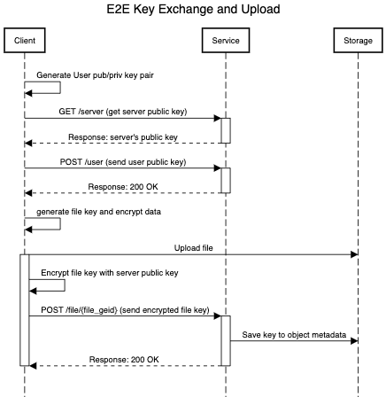

# service_encryption

[](https://www.gnu.org/licenses/agpl-3.0)
[](https://www.python.org/)

## Development

Requirements:
- Python 3.7
- Virtualenv
- Docker 

To run locally:
```bash
virtualenv venv
source venv/bin/activate
pip install -r requirements
python app.py
```

To run with docker:
```bash
docker build . -q 
docker run <image_id_from_build>
```


## Design

Every file is encrypted with a random secret key generated at encryption/upload time.
The communication of this key is securely transferred using both client and server public key exchange. 


